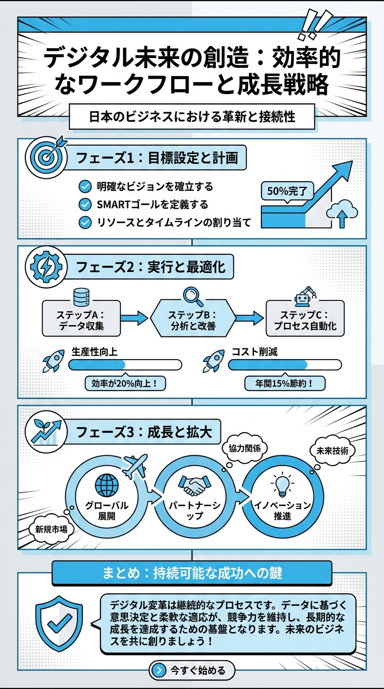

# 3D立体オセロ - ドキュメント

  
  

> 🖼️ 図解付きページ — 上が **プロジェクト概要漫画**、下が **このページ専用インフォグラフィック** です。

⚫ 3D立体オセロ プロジェクトの全 **1 本** の Markdown ドキュメント集です。

📱 本サイトはモバイル対応 (iPhone / Android / iPad)。
🔗 GitHub: https://github.com/shimanto/othello3d

---

> 🖼️ = 図解付きページ (漫画 + インフォグラフィック)

## 📚 ドキュメント一覧

### 🏁 プロジェクト全体

| ドキュメント | GitHub |
|---|---|
| README | [README.md](https://github.com/shimanto/othello3d/blob/HEAD/README.md) |

---

## 🌐 本サイトについて

このページは [Docsify](https://docsify.js.org/) ベースの**ビルド不要 / モバイル対応**の静的 MD ビューアです。

- **更新**: `docs/*.md` を編集 → `git push` で再デプロイ
- **ローカル**: `npx serve docs` で `http://localhost:3000/` 確認
- **テンプレート**: [lineclaude/docs/docsify-template-guide.md](https://lineclaude-docs.pages.dev/#/docsify-template-guide) を参照して他プロジェクトにも 10 分で移植可
